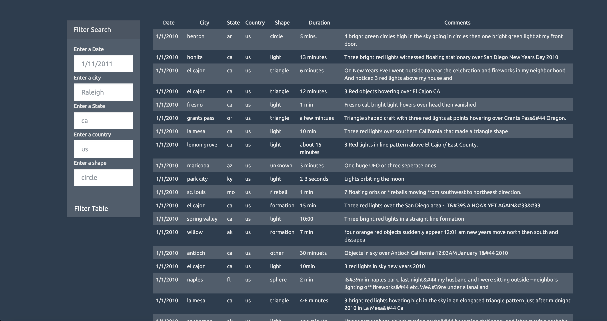

# JavaScript Homework - JavaScript Challenge

## Background

The extra-terrestrial menace has come to Earth and we here at `UNC-Bootcamp` have collected all of the eye-witness reports we could to prove it! We have attempted to put this out on the worldwide web for everyone to see. 

Our collection is too large to search through manually. Even our most dedicated followers are complaining that they are having trouble locating specific reports in this mess. So we have given you an application in Javascript that lets you search the data quickly and easily

# Application 1

This application is a Javascript based table that is searchable by the date of the sightings. Using the UFO dataset provided in the form of an array of JavaScript objects, wrote code that appends a table to the web page and then adds new rows of data for each UFO sighting.

# Application 2
This application lets the user to be able to search by multiple attributes: date/time, city, state, country and shape. The application uses multiple input fields and  JavaScript code so the user can be able to set multiple filters and search for UFO sightings.

## The application 
Application can be found here: https://fsutharshan.github.io/Javascript-Challenge/

## Screenshots

